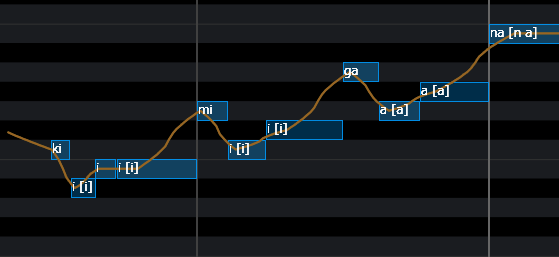
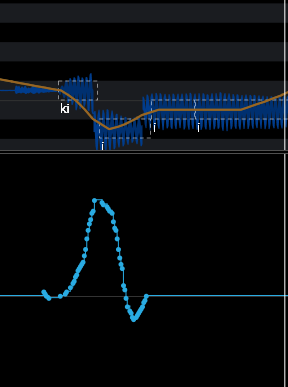

# 首先准备一个无参工程
你可以自己扒谱或者使用他人制作的工程
如：vsqx.top

>[!TIP]tip
>2019年的deco*27调出来的miku音头明显变重，所以需要加重音头

用裁切工具裁切出音头前三格，
然后上下摆摆.

（当然，用音高画笔把音头拉高也是可以的）
>[!NOTE] NOTE
>裁切出来的音符一定不要加转音符号（-）
>这会让音符声音变小

# 修改DYN

 在音头拉高
>[!TIP]tip
>可以在混音的时候选择ott压缩人声

<iframe width="100%" height="468" src="https://www.bilibili.com/video/BV1xxwKz2ET8/?spm_id_from=333.1387.homepage.video_card.click&vd_source=e11354cf9d8e424c750a1877db81b3fe=0" scrolling="yes" border="0" frameborder="no" framespacing="0" allowfullscreen="true" &autoplay=0> </iframe> 
这样，我们就成功调出充满DECO味的miku啦喵