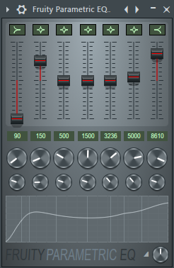
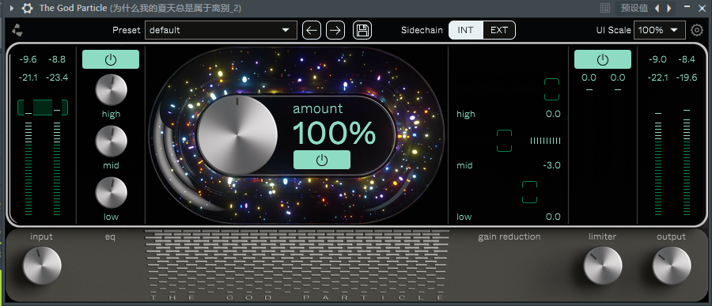
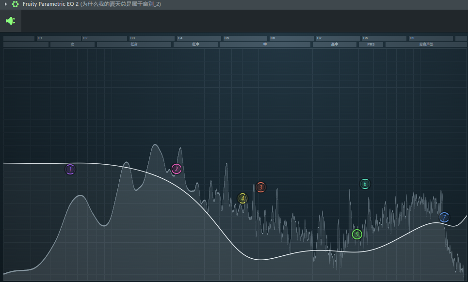
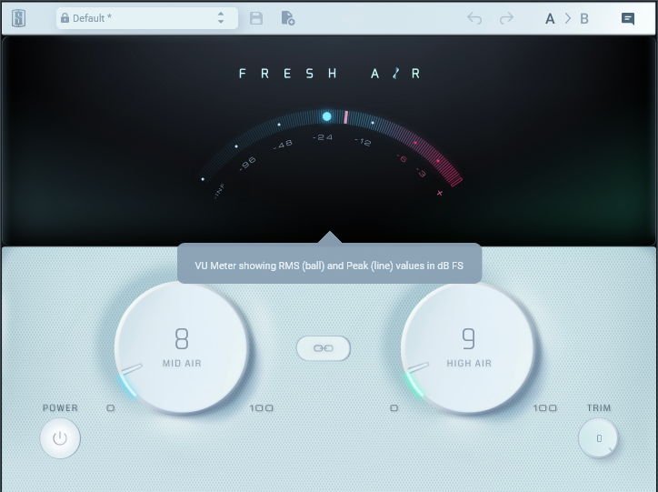
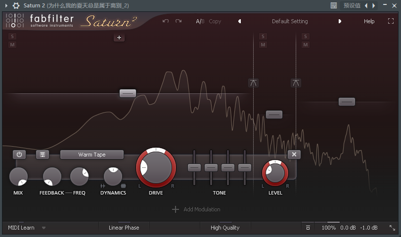

众所周知，初音未来的感冒非常严重，所以我带来了初音未来的感冒药~💊

>[!NOTE]物料表
>EQ
>EQ2
>Fresh Air
>上帝粒子
>saturn2
# 第一步-EQ
使用EQ添加到人声上

# 第二步-上帝粒子
把bgm和vocal导入到宿主软件里面，在总轨加入上帝粒子

# 第三步-EQ2
加载EQ2，把绿色使劲压，再把高频压一下

# 第四步-fresh air和saturn2
因为第三步，导致声音显得很虚假，所以在这里我们再加入两个压缩器

---
那么，miku的感冒已经消除60%了！剩下的可以挂个人声去齿音的工具，并通过修改bgm与vocal的音量去鼻音。
感谢你读到这里

* 加个小私货
<iframe frameborder="no" border="0" marginwidth="0" marginheight="0" width=330 height=86 src="//music.163.com/outchain/player?type=2&id=3406955304&auto=1&height=66"></iframe>
可是，真的很好听呀。